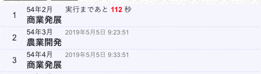

## コマンドの実行

三国志NETでは、武将が行動するときにコマンドを入力します。  
コマンドは、入力即実行されるわけではありません。例えば、

以上のように入力すると、

* 今から112秒後（9時13分51秒）に商業発展を実行
* 9時23分51秒に農業開発を実行
* 9時33分51秒に商業発展を実行

というふうに実行されます。

### 更新時刻

武将は、それぞれが自分の更新時刻を持ちます。上の例の場合、コマンドリストの先頭は54年2月となっていますが、処理は以下のように実行されます。

| 実行時刻 | 実行内容 |
|---|---|
| 9時10分00秒 | 54年2月に切り替わる |
| 9時12分31秒 | 武将Aのコマンド実行 |
| 9時13分51秒 | 武将Bのコマンド実行 |
| 9時17分30秒 | 武将Cのコマンド実行 |
| 9時20分00秒 | 54年3月に切り替わる |

武将Bは、武将Aより後にコマンドが実行されます。また、武将Bは、武将Cより先にコマンドが実行されます。  
この順番は、戦争のときに重要になってくる場合があります。国の武将の更新時刻一覧は、国情報の武将から確認できます。

### 更新開始

コマンドは、0年1月〜23年12月までの間には実行されません。  
その期間中に入力したコマンドは、24年1月以降に順次実行されます。

## 入力できるコマンド

[コマンド一覧](bas-commands.html)より確認できます。