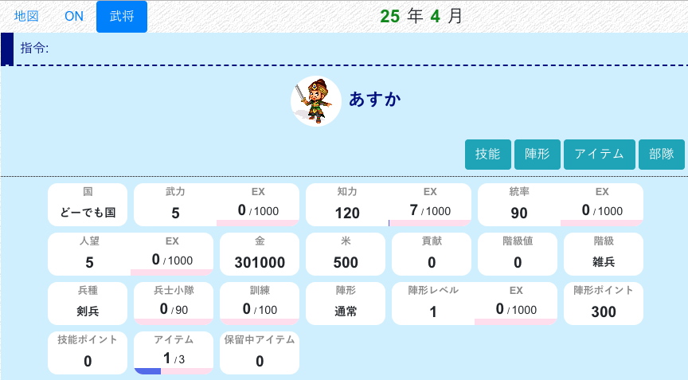
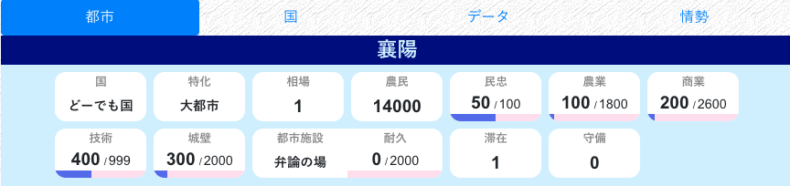

## 概要

[新規登録](bas-g-entry.html)を終えた後、またはログインした後、ステータス画面に移動します。

ここでは、武将、都市、国の持つパラメータについて、簡単に説明します。

パラメータはたくさんあります。ここで全部覚える必要はなく、ガイドの続きのページでも都度説明します。気楽に読み流してください。  
最初にまとめて知るものとしてあまり重要ではないパラメータについては、名前をかっこで囲んでいます。適宜読み飛ばして、後で参照するなりしてください。

## 武将

武将のパラメータは、PCでは画面左上、スマホでは画面最上部にある「武将」タブより確認できます。

### 武力

武将の能力です。これが高いほど、戦闘で強くなります。通常は統率と併用します。

### 知力

武将の能力です。これが高いほど、内政が早く進みます。

### 統率

武将の能力です。これが高いほど、たくさんの兵士を雇えます。雇える兵指数の最大は、統率と同じです。

### 人望

武将の能力です。これが高いほど、民忠を早く上げられます。使い道ははっきり言ってないです（最序盤では必要とされますが、本当に最序盤だけです）。  
出身で武家・文官を選んだ場合、人望は最低の `5` になっているはずです。

### 金

武将の所持する金です。内政、軍備などあらゆることに使えます。

### （米）

武将の所持する米です。はっきり言って、持久戦にならない限り `20000` を超える分は持っているだけ無駄です。都市の相場が `1.2` またはそれに近い値になっていたら、早々に米売買コマンドで売って金にかえましょう。

### （貢献、階級値、階級）

内政など国に貢献するコマンドを実行すると、貢献が上がります。（[コマンド一覧](bas-commands.html)も参照）

毎年 `1`、`7` 月になると、貢献は `0` となり、もとあった貢献は階級値に加算されます。

階級値が一定の値に到達すると、階級が上がります。

#### （収入）

毎年 `1` 月には金、`7` 月には米の収入を得ます。収入は、階級が高いほど一度にたくさんもらえます。収入は通常は階級に応じた一定の寮となりますが、国全体の収入が少ない場合は、貢献に応じて変動することがあります。

詳しい説明は[収入](dom-income.html)にあります。

### 兵種

武将の兵種です。戦闘時の強さに影響します。

徴兵することで変更できます。

[兵種](dip-soldier.html)に詳しい説明がありますが、ガイドの戦争編でも説明します。

### 兵士小隊

武将の兵士小隊数です。他の三国志NETでは「兵士数」と呼ばれます。文字通り、兵士の数で、武将の戦闘におけるヒットポイントです。上限は武将の統率です。

徴兵することで増やすことができます。

### （訓練）

武将の訓練値です。これが高いほど戦争の時に有利になりますが、`0` のまま戦争する人も多いです。

### （陣形）

※第0.7期現在、陣形はただの飾りでしかないので気にしなくて大丈夫です

武将の戦闘時に使用する陣形です。陣形には陣形経験値、陣形レベル、陣形ポイントが存在します。

* 陣形の種類、レベルにより、戦闘時に特定の補正がかかります
* 陣形経験値がたまると陣形レベルが上がり、陣形が強化されます
* 陣形そのものは、陣形ポイントを使って増やします

[陣形](dip-formation.html)に詳しい説明があります。

### （技能ポイント）

武将は、出身に応じて技能を持ちます。武家には武家向けの、文官には文官向けの技能が用意されています。  
技能ポイントが `10` など決まった値に到達すると、新しい技能を獲得することができます。

[出身](bas-from.html)に詳しい説明がありますが、ガイドの内政編でも技能の獲得について説明します。

### （アイテム）

武将の持っているアイテムです。所持数には上限があります。現在持っているアイテムと効果は、「アイテム」ボタンをクリックすることで確認できます。

売買、内政などで手に入れます。[アイテム](bas-item.html)に詳しい説明がありますが、ガイドの内政編でも説明します。

他の三国志NETでいう「武器」「書物」をさらに強化したシステムです。

## 都市

### （特化）

都市には特化があり、特化ごとに内政の最大値が変化します。基本的には無視します。

### 農民

都市の人口です。これが高いほど、`1`、`7` 月の金・米収入が増えるだけでなく、たくさんの兵士を徴兵できます。

おもに、民忠を上げることで回復します。

### 民忠

都市の民忠です。これが `50` より高いほど、`1`、`7` 月に農民が増えます。逆に低いと、農民は減ってしまいます。

おもに、徴兵の時に減り、米施しによって回復します。

### 農業、商業

都市の農業と商業です。これが高いほど、`1`、`7` 月の金・米収入が増えます。

### 技術

都市の技術です。これが高いほど、高級兵種が雇えるだけでなく、城壁を守る兵士の強さも変わります。

### 城壁

都市の城壁です。これが高いほど、落城しにくくなります。城壁は、戦争において、都市のヒットポイントに相当します。

### （都市施設）

都市に固有の施設です。耐久を上げることによって、効果を発揮します。種類によって、効果が変わります。

[都市施設](dom-townbuilding.html)に詳しい説明があります。

### 守備

都市を守備している武将数です。戦争において都市に攻め込まれたとき、守備があると守備武将が応戦します。（守備武将がいなければ城壁との戦闘になります）

## 国

### （政策ポイント）

国の持つ政策ポイントです。政策開発コマンドによって上げることができます

### （金・米収入）

国の直近の収入量です。

### （国庫残高）

国庫の残高金です。

## このあと

序盤にやること、内政について説明します。[ガイド（内政編）](bas-g-domestic.html)へ移動します
