## 概要

三国志NET KMY Versionは、他の三国志NETとは異なり、ゼロから組み直され、UIもゼロから作られたものです。三国志NETが誕生した時代には存在しなかったスマートフォンや、UX[^1]における一般的な考え方、レスポンシブデザイン[^2]という考え方などによってUIが設計されています。そのため、UIが他の三国志NETと異なり、全く別のゲームに見えるかもしれません。  
ゲームシステム自体は旧来の三国志NETを踏襲したものなので、UIに慣れると後が簡単だと思います。

画面はリアルタイムで更新されます。もう少し詳しく知りたい方は、少々専門的な説明になりますが、[リアルタイム更新](bas-realtime.html)も参照してください。

[^1]: UIを使うユーザの体験。ここでは、ユーザがUIに対して好印象を持つようUIを工夫する行為をさす
[^2]: どのような画面サイズでもコンテンツを正常に表示できるよう、コンテンツの配置を工夫すること。昔は特定の画面サイズで見られることを前提に、コンテンツのサイズや配置を固定にしているサイトが多かった

## ステータス画面全体

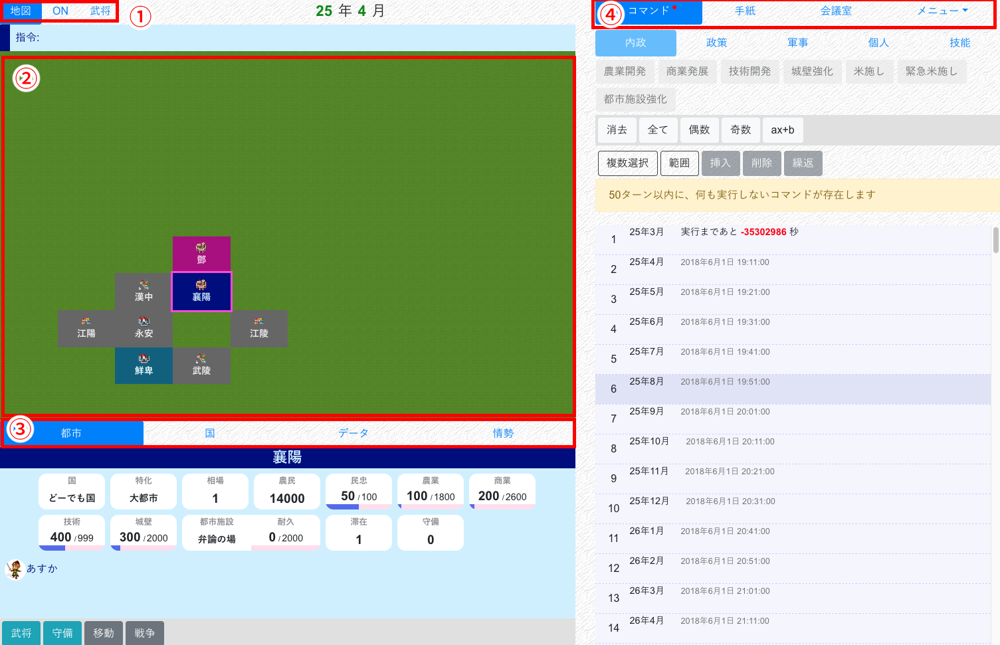

| 番号 | 名前 | 備考 |
| -- | -- | -- |
| 1 | 地図切り替えタブ | |
| 2 | 地図 | |
| 3 | 情報タブ | |
| 4 | メニュータブ |

### 地図切り替えタブ

### 地図

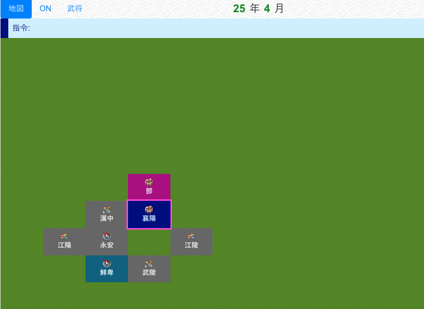

現在所在中の都市がハイライトされます。

都市をクリックすることで、その都市に赤い枠が付き、選択状態になります。  
選択状態になった都市は、以下のように利用します。

* 選択中の都市の情報が、情報タブに表示される
* 移動・戦争コマンド入力時に、対象の都市として設定される

#### ONタブ

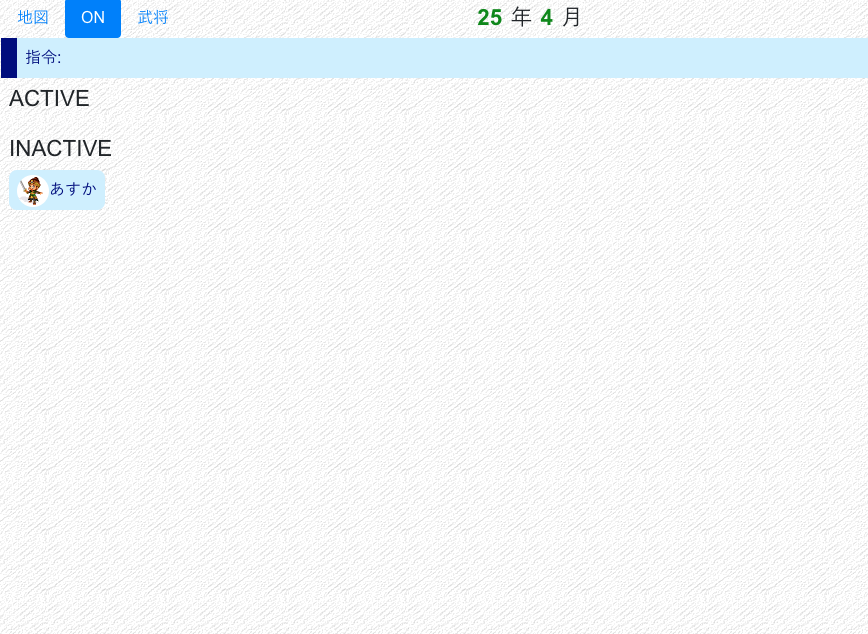

武将のON状況を表示します。[オンライン](bas-online.html)も参照してください。

#### 武将情報タブ

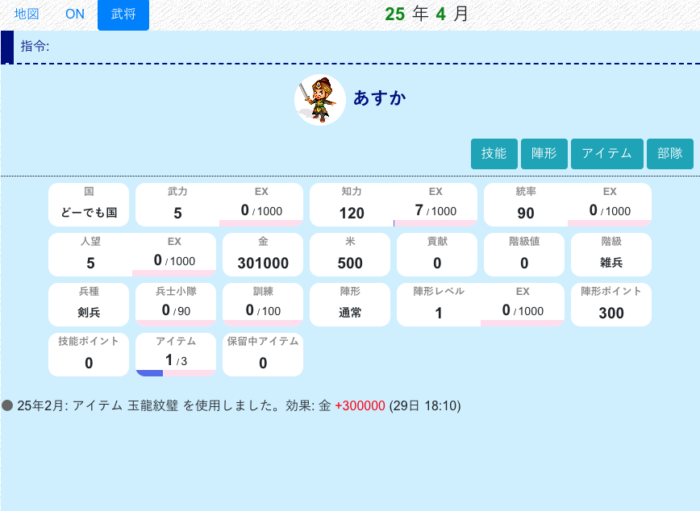

武将情報、および武将行動ログ（武将ログ）を表示します。

### 情報タブ

#### 都市情報タブ

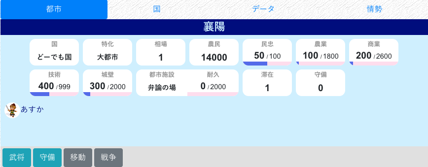

都市の情報、滞在武将を表示します。

| ボタン名 | 出現条件 | 説明 |
| -- | -- | -- |
| 武将 | 自国または滞在中 | その都市にいる武将一覧を表示します |
| 守備 | 自国または滞在中 | その都市を守備している武将一覧を表示します |
| 武将（当時） | 諜報された他国都市 | その都市に諜報時点で滞在している武将一覧を表示します |
| 守備（当時） | 重宝された他国都市 | その都市に諜報時点で守備している武将一覧を表示します |
| 諜報 | 滞在中の他国都市 | その都市を諜報し、情報を自国で共有します |
| [攻略](dip-townwar.html) | 他国都市 | その都市の攻略情報を確認、または攻略を実行します |

#### 国情報タブ

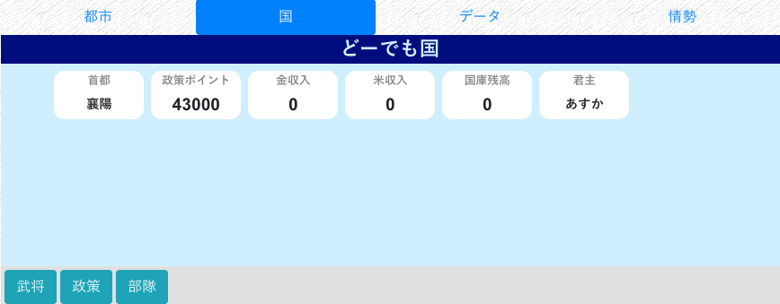

国の情報、官職を表示します。

| ボタン名 | 出現条件 | 説明 |
| -- | -- | -- |
| 武将 | 全国 | その国に所属する武将一覧を表示します。任命もここでします |
| 部隊 | 自国 | その国の部隊一覧を表示します |
| 政策 | 自国 | その国の政策一覧を表示します |
| 同盟 | 他国 | その国と自分の国の同盟関係を確認、または申請・締結します |
| 戦争 | 他国 | その国と自分の国の戦争関係を確認、または布告します |
| 国宛 | 他国かつ君主軍師 | その国に国宛手紙を送ります |

#### データタブ

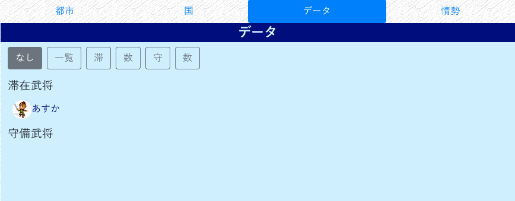

国の都市の数値一覧、武将の配置などを一括で表示します。

#### 情勢タブ

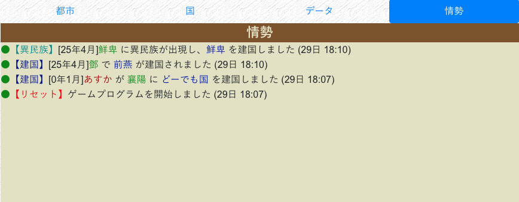

最新のマップログを表示します。

### メニュータブ

#### コマンドタブ

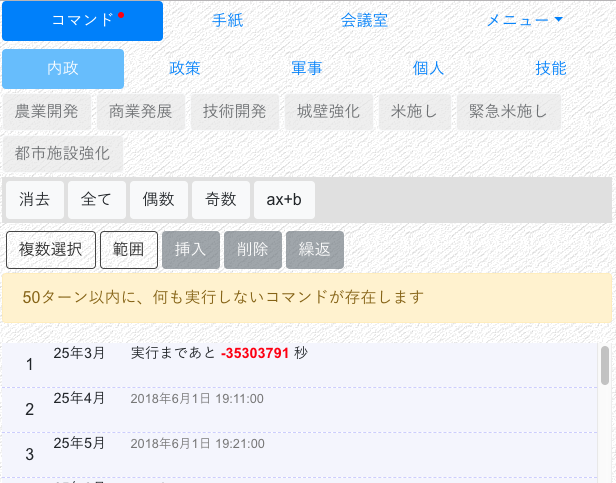

コマンドを表示・入力します。[コマンド](bas-command.html)も参照してください。

#### 手紙タブ

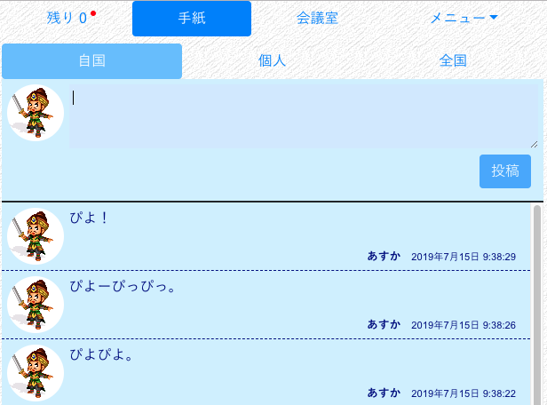

手紙を表示・投稿します。

#### 会議室タブ

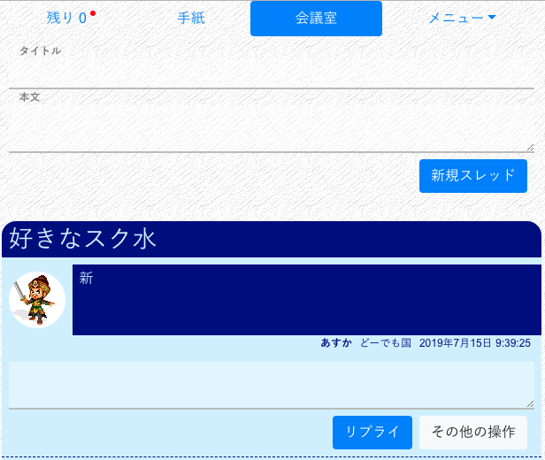

会議室を表示・投稿します。

#### 追加メニュー

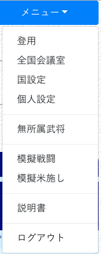

さらにいろいろな機能を利用できます。

## レスポンシブデザイン

KMYの画面は通常２カラムですが、スマホなど幅の狭い画面から利用すると１カラムになります。

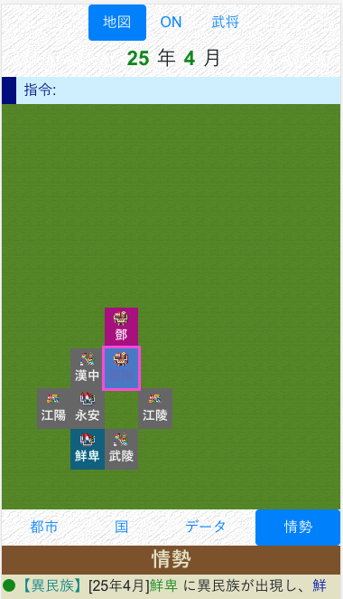

この場合、右側にあったカラムは画面下に移動します。スクロールすることで参照できます。

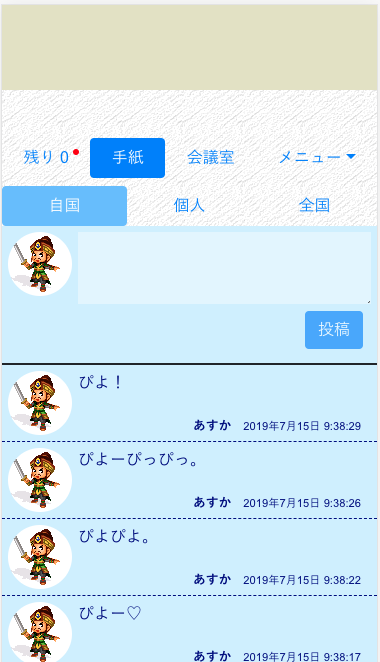

## 画面がおかしくなった場合は

何らかの理由で、画面表示がおかしくなったり、手紙や情報の更新が止まることがあります。その場合は、`F5`（または `Cmd+R`、その他の手段）を用いてブラウザ画面を更新してみてください。
